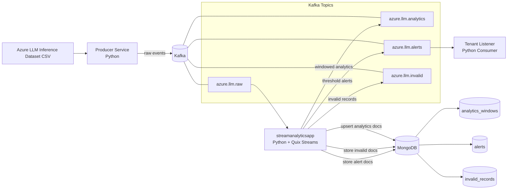
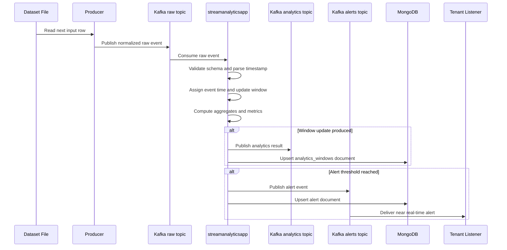
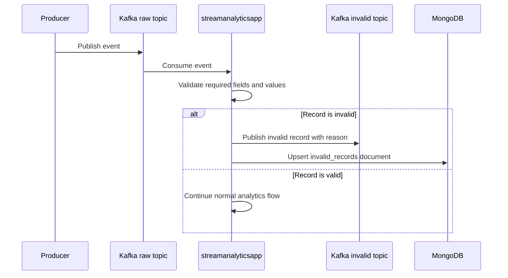
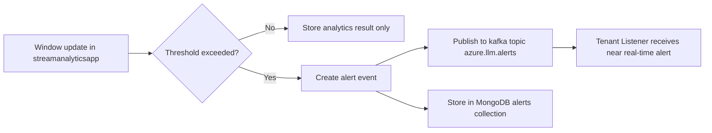
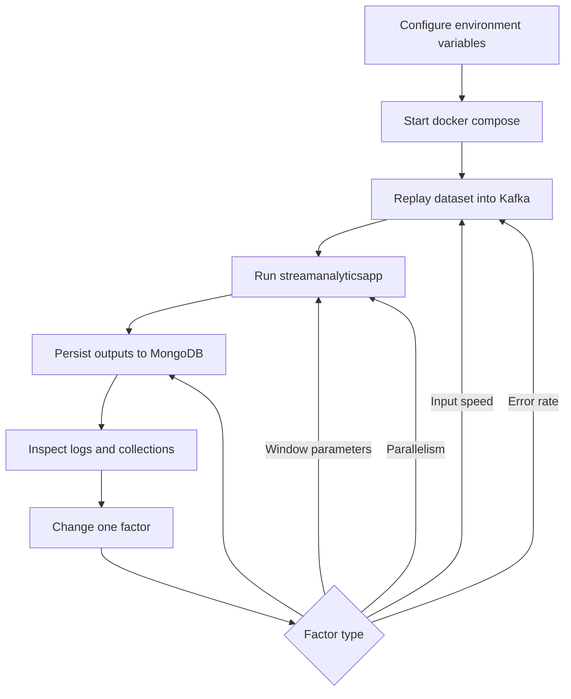

# mysimbdp -- Streaming analytics platform

The purpose of this streaming analytics platform is to ingest, process, and analyze LLM inference events in near real time so that a tenant can monitor usage patterns, detect abnormal behavior early, and persist analytics results for later investigation and reporting. The platform was built with the following technologies:

- **Python** for all custom code
- **Apache Kafka** as the messaging system
- **Quix Streams** as the stream processing framework
- **MongoDB** as `mysimbdp-coredms`
- **Docker Compose** as the local multi-container test environment
- **Azure LLM inference trace** as the replayed input dataset

The implementation is simple: one tenant-side replay producer, one streaming analytics application, one persistent sink, and one tenant-side alert consumer. This `README` covers the implementation details of the repository, more details on how the questions in the assignments are addressed can be found in the report.

## Repository layout

```text
streaming-analytics-starter/
├── docker-compose.yml
├── .env.example
├── data/
│   └── azure_llm_inference.csv
├── mongodb/
│   └── init/
│       └── 01-init.js
├── producer/
│   ├── Dockerfile
│   ├── requirements.txt
│   └── app/main.py
├── streamanalyticsapp/
│   ├── Dockerfile
│   ├── requirements.txt
│   └── app/main.py
├── tenant_listener/
│   ├── Dockerfile
│   ├── requirements.txt
│   └── app/main.py
└── tools/
    └── summarize_results.py
```

## Architecture

The platform models a tenant that streams LLM inference records into Kafka. The platform provider offers Kafka, the stream processing runtime, and MongoDB storage. The tenant receives alerts back in near real time.

### Component overview



### Responsibilities of each component

| Component | Role |
|---|---|
| Producer | Replays the Azure LLM trace as a near real-time Kafka stream |
| Kafka | Messaging backbone between tenant producer, stream processor, and tenant consumers |
| `streamanalyticsapp` | Validates records, applies windowed analytics, detects alert conditions, and writes results |
| MongoDB | Stores analytics windows, alerts, and invalid records for later inspection |
| Tenant Listener | Receives alert messages in near real time from Kafka |
| Summary tool | Reads MongoDB output after experiments and summarizes results |

### Topic design

| Topic | Purpose |
|---|---|
| `azure.llm.raw` | Input stream of raw tenant events |
| `azure.llm.analytics` | Output stream of windowed analytics results |
| `azure.llm.alerts` | Output stream of alert events for tenant notification |
| `azure.llm.invalid` | Output stream of invalid or malformed records |

### MongoDB collections

| Collection | Purpose |
|---|---|
| `analytics_windows` | Persistent storage for aggregated window results |
| `alerts` | Persistent storage for generated alerts |
| `invalid_records` | Persistent storage for records that fail validation |

## Runtime workflows

### 1. Normal analytics workflow



### 2. Invalid record workflow



### 3. Alerting workflow



### 4. Experiment workflow used in Part 2



## Implementation-facing schemas

The producer normalizes the dataset into a stable input event schema. The stream application emits a normalized analytics window schema and a normalized invalid-record schema. These schemas are important because the implementation depends on required fields, predictable types, deterministic IDs, and explicit schema versions.

### Input event schema

Produced by `producer/app/main.py` and sent to `azure.llm.raw`.

```json
{
  "event_id": "sha256...",
  "schema_version": "1.0.0",
  "event_time_ms": 1715300000000,
  "service_name": "example-service",
  "context_tokens": 1200,
  "generated_tokens": 300,
  "source": "azure-llm-inference-dataset-2024",
  "ingested_at_ms": 1715300000500
}
```

Field notes:

| Field | Meaning |
|---|---|
| `event_id` | Deterministic identifier used to reduce duplicate side effects |
| `schema_version` | Explicit input schema version used for contract control |
| `event_time_ms` | Event time used by the stream processor for windowing |
| `service_name` | Tenant-side grouping key used for keyed processing |
| `context_tokens` | Input/prompt-side token count |
| `generated_tokens` | Output/completion-side token count |
| `source` | Data origin label |
| `ingested_at_ms` | Producer-side ingestion timestamp used for latency estimation |

### Analytics window schema

Produced by `streamanalyticsapp/app/main.py`, sent to `azure.llm.analytics`, and upserted into MongoDB collection `analytics_windows`.

```json
{
  "window_id": "sha256...",
  "schema_version": "1.0.0",
  "service_name": "example-service",
  "window_start_ms": 1715300000000,
  "window_end_ms": 1715300060000,
  "window_duration_sec": 60,
  "window_step_sec": 30,
  "grace_sec": 10,
  "request_count": 42,
  "context_tokens_sum": 50400,
  "generated_tokens_sum": 12600,
  "context_tokens_avg": 1200.0,
  "generated_tokens_avg": 300.0,
  "max_generated_tokens": 800,
  "avg_processing_latency_ms": 120.0,
  "max_processing_latency_ms": 500,
  "throughput_rps": 0.7,
  "updated_at_ms": 1715300060100
}
```

Field notes:

| Field | Meaning |
|---|---|
| `window_id` | Deterministic identifier for the logical analytics window |
| `window_start_ms`, `window_end_ms` | Window boundaries |
| `window_duration_sec`, `window_step_sec`, `grace_sec` | Runtime window configuration captured in output |
| `request_count` | Number of events processed in the window |
| `context_tokens_sum`, `generated_tokens_sum` | Window token totals |
| `context_tokens_avg`, `generated_tokens_avg` | Window token averages |
| `max_generated_tokens` | Peak generated-token value in the window |
| `avg_processing_latency_ms`, `max_processing_latency_ms` | Observed processing latency metrics |
| `throughput_rps` | Requests per second derived from the window |
| `updated_at_ms` | Processing-side timestamp of the emitted result |

### Alert schema

Produced by `streamanalyticsapp/app/main.py`, sent to `azure.llm.alerts`, and upserted into MongoDB collection `alerts`.

```json
{
  "alert_id": "sha256...",
  "alert_type": "request_count+generated_tokens_sum",
  "alert_created_at_ms": 1715300060200,
  "window_id": "sha256...",
  "schema_version": "1.0.0",
  "service_name": "example-service",
  "window_start_ms": 1715300000000,
  "window_end_ms": 1715300060000,
  "request_count": 42,
  "generated_tokens_sum": 12600
}
```

### Invalid-record schema

Produced by `streamanalyticsapp/app/main.py`, sent to `azure.llm.invalid`, and stored in `invalid_records`.

```json
{
  "event_id": "sha256...",
  "schema_version": "1.0.0",
  "received_at_ms": 1715300000600,
  "reason": "missing:event_time_ms",
  "raw_record": {"...": "..."}
}
```

## Key performance metrics used in the implementation

We use these metrics because they provide a practical basis for assessing how well the platform performs in a streaming setting, especially when it comes to processing speed, latency, stability, fault handling, and the effect of configuration changes in the test environment.

| Metric | Definition | How it is measured in this implementation | Why it matters |
|---|---|---|---|
| Throughput (`throughput_rps`) | Number of processed requests per second within a window | Derived in `streamanalyticsapp/app/main.py` as `request_count / window_duration_sec` and stored in `analytics_windows` | Shows whether the platform keeps up with incoming load |
| Average processing latency | Average time from producer ingestion to stream-app aggregation | Computed from `now - ingested_at_ms` for each event and aggregated into `avg_processing_latency_ms` | Helps the platform operator detect delay growth under pressure |
| Maximum processing latency | Highest observed per-event latency in a window | Aggregated into `max_processing_latency_ms` | Useful for worst-case behaviour and SLA-style discussion |
| Request count | Number of events in a window | Aggregated into `request_count` | Basic demand indicator and alert trigger |
| Generated token volume | Total generated tokens in a window | Aggregated into `generated_tokens_sum` | Useful proxy for service load and output-side cost |
| Invalid-record rate | Share or count of malformed events | Measured by inspecting Kafka topic `azure.llm.invalid` or MongoDB collection `invalid_records` | Shows data quality and robustness of the pipeline |
| Alert rate | Number of generated alerts over time | Measured from Kafka topic `azure.llm.alerts` or MongoDB collection `alerts` | Indicates abnormal service conditions |
| Consumer lag | Delay between Kafka production and consumption | Measured with Kafka tooling and consumer-group inspection | Important for capacity planning and scaling decisions |

## What each component does

### `producer/app/main.py`
- loads the Azure CSV
- normalizes each row into the input event schema
- assigns event time and Kafka message timestamps
- replays the file as a stream with configurable speed
- injects erroneous records for testing through `ERROR_RATE`
- publishes raw events to Kafka topic `azure.llm.raw`

### `streamanalyticsapp/app/main.py`
- consumes `azure.llm.raw`
- validates required fields and token values
- routes invalid records to Kafka topic `azure.llm.invalid` and MongoDB collection `invalid_records`
- groups valid events by `service_name`
- computes hopping-window analytics
- writes analytics to Kafka topic `azure.llm.analytics` and MongoDB collection `analytics_windows`
- emits alerts to Kafka topic `azure.llm.alerts` and MongoDB collection `alerts`

### `tenant_listener/app/main.py`
- simulates the tenant-side consumer of near real-time alerts
- subscribes to `azure.llm.alerts`
- prints received alerts to the container log

### `mongodb/init/01-init.js`
- creates the required collections
- adds indexes and uniqueness constraints for analytics windows, alerts, and invalid records

### `tools/summarize_results.py`
- summarizes the persisted MongoDB results after a run
- prints counts, average throughput, average latency, common alert types, and invalid reasons

## Run instructions

1. Copy `.env.example` to `.env`.
2. Start the platform:

```bash
docker compose up --build
```

## Where to look for logs and evidence

Use Docker Compose logs for the evidence required in the report:

```bash
docker compose logs producer
docker compose logs streamanalyticsapp
docker compose logs tenant-listener
```

Useful Kafka commands can be run in the Kafka container, for example topic inspection and consumer-group lag checks.

MongoDB collections can be inspected to verify normal outputs, alerts, and invalid-record handling.

## Experimental parameters used in Part 2

### Stream speed
- `REPLAY_SPEED_MULTIPLIER`
- `MAX_MESSAGES`
- `LOOP_DATASET`

### Windowing and late data
- `WINDOW_SIZE_SEC`
- `WINDOW_STEP_SEC`
- `LATE_GRACE_SEC`

### Alerts
- `ALERT_REQUEST_COUNT_THRESHOLD`
- `ALERT_GENERATED_TOKENS_THRESHOLD`

### Erroneous data tests
- `ERROR_RATE`

### Parallelism tests
- `RAW_TOPIC_PARTITIONS`
- `ANALYTICS_TOPIC_PARTITIONS`
- `ALERTS_TOPIC_PARTITIONS`
- scaling the app with:

```bash
docker compose up --scale streamanalyticsapp=2
```

## Assignment-point to file mapping

- **Architecture and environment**: `docker-compose.yml`
- **Input replay and error injection**: `producer/app/main.py`
- **Validation, windows, analytics, alerts**: `streamanalyticsapp/app/main.py`
- **Near real-time tenant path**: `tenant_listener/app/main.py`
- **MongoDB collections and indexes**: `mongodb/init/01-init.js`
- **Post-run result summary**: `tools/summarize_results.py`

## Notes and limitations

- The current configuration uses **at-least-once** processing because that is the default set in the environment.
- MongoDB writes are made more robust with deterministic IDs, unique indexes, and upserts, but this does **not** mean full end-to-end exactly-once.
- The producer contains fallback column-name candidates because downloaded CSV headers may vary slightly.
- Part 3 extension ideas are deliberately kept out of the `README` and discussed in the report, because that part of the assignment does not require implementation.
